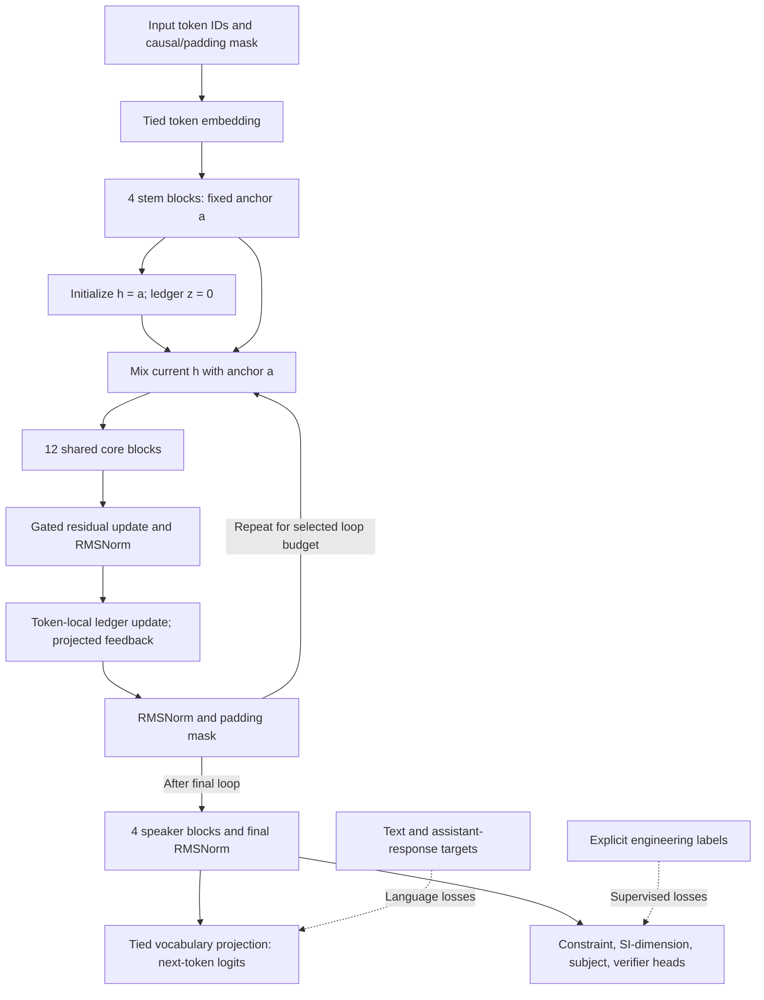

# FORGE-1B — Independent architecture review brief

**Date:** 2026-09-28  
**Implementation snapshot:** `2c8f1aa6ce431440efef13af98f294ca0e7cf108`  
**Purpose:** Technical criticism before expensive training. This document contains
no training data, credentials, or personal filesystem paths.

## 1. Objective and current status

FORGE-1B is a from-scratch, text-only language-model research project targeting
mechatronics, engineering mathematics, materials science, and warm technical
conversation. The ambition is unusually strong specialist performance at roughly
one billion parameters. Frontier parity is an aspiration, not an established
result or a consequence of the architecture.

The implementation starts with random weights. No pretrained weights, pretrained
tokenizer, or external training corpus is supplied. A 49,152-token BPE is intended
to be trained on approved private training data. PyTorch and tokenization software
are implementation dependencies. A production dataset and trained specialist do
not yet exist in this deliverable.

The design combines established transformer components and recurrent-depth ideas
with a small recurring evidence state and auxiliary engineering supervision.
“Evidence,” “speaker,” and lane names describe proposed roles; they do not prove
reasoning, physical understanding, or semantic specialization.

## 2. Exact architecture

| Component | Specification |
|---|---|
| Unique trainable parameters | **1,003,169,935**, counted from actual tensors |
| Vocabulary / hidden width | 49,152 / 2,048 |
| Query / KV heads | 16 / 4; head dimension 128 |
| Feed-forward | SwiGLU; intermediate width 5,632 |
| Unique blocks | 4 stem + 12 shared core + 4 speaker |
| Context capacity | 4,096 tokens; not a demonstrated training-quality limit |
| Position encoding | RoPE, base 10,000 |
| Normalization | Learned RMSNorm before and after each residual sublayer |
| Embedding/output | One tied vocabulary matrix |
| Evidence state | Four named lanes × 32 values, per token, per forward call |
| Inference budgets | Fast 1, balanced 2, deep 4 core loops |
| Main initialization | Linear/embedding weights normal, standard deviation 0.02 |

Attention and feed-forward projections are bias-free. Auxiliary heads have biases.
Padding is masked; positional indices count valid tokens. No token can attend
to future tokens. The reference attention path uses PyTorch SDPA and explicitly
repeats KV heads for compatibility rather than relying on a fused GQA kernel.

| Parameter group | Unique parameters |
|---|---:|
| Tied vocabulary matrix | 100,663,296 |
| Stem | 180,387,840 |
| Shared core | 541,163,520 |
| Speaker | 180,387,840 |
| Evidence module | 528,512 |
| Auxiliary heads | 30,735 |
| Additional gates/norms | 8,192 |

Fast, balanced, and deep execute **20, 32, and 56 transformer blocks** respectively.
Repeated execution adds FLOPs and activation work, not unique weights. A separate
99,825,487-parameter configuration supports smaller experiments; its checkpoint
is not directly compatible with the full model.

## 3. Accurate forward dataflow



The auxiliary heads read **final speaker states**, not individual ledger lanes.
Their losses can train upstream representations through gradients. Their predicted
values are not fed back as symbolic constraints. The diagram shows a design to
train, not an observed human-like thought process.

### Recurrence pseudocode

Here `*` is elementwise multiplication; gates are learned, input-independent
channel parameters shared across loops. `N` is the same learned recurrent RMSNorm
module used at both indicated locations. Core weights are also shared.

```text
a = stem(embedding(tokens))
h = a
z = zeros(batch, tokens, 4, 32)
rho   = sigmoid(anchor_logits)       # initialized to 0.9
beta  = sigmoid(update_logits)       # initialized to 0.5
eta   = sigmoid(ledger_rate_logits)  # 4 x 32, initialized to 0.5
gamma = sigmoid(injection_logits)    # 2048 values, initialized to sigmoid(-2)

repeat r times:
    mixed = rho * h + (1-rho) * a
    candidate = shared_core(mixed, causal_mask)
    u = N((1-beta) * h + beta * candidate)
    proposal = reshape(tanh(W_read * ledger_RMSNorm(u)), 4, 32)
    z = ((1-eta) * z + eta * proposal) * valid_token_mask
    feedback = gamma * W_write(flatten(z))
    h = N(u + feedback) * valid_token_mask

final = final_RMSNorm(speaker(h, causal_mask)) * valid_token_mask
logits = final * embedding_weights_transposed
auxiliary_predictions = four_heads(final)
```

Without the ledger, the second normalization/feedback path is omitted. This means
the existing ledger-on/off ablation changes both feedback and normalization count;
a better-isolated control should retain the same normalization schedule.

### What the ledger actually is

The evidence module reads 2,048 features into 128 values and writes them back through
a linear projection. Its state is a bounded, elementwise exponential-style update
of tanh proposals. It adds no cross-token communication beyond that already
provided by causal attention. State persists across core loops within one forward
call; it is reinitialized for the next full-prefix generation call and across
requests.

The names are **quantity, dynamics, material, constraint**. There are no dedicated
per-lane labels, lane-specific loss functions, unit algebra, physical equations,
or separate lane networks. The four-by-32 partition is currently a reshape of a
128-dimensional state with learned per-coordinate rates. Semantic lane separation
is therefore unestablished and may be equivalent to an unnamed 128-value vector.

Bounded mixing coefficients and a bounded ledger do not prove stable hidden-state
dynamics: attention/MLP Jacobians, normalization, and learned read/write weights
remain relevant. No contraction or convergence theorem is claimed.

## 4. Supervision and training lifecycle

The auxiliary outputs are four binary constraint logits, seven real SI exponents,
three subject-class logits, and one verifier logit per token. Losses are applied at
explicitly annotated sequence positions. SI order is mass, length, time, current,
temperature, amount, luminous intensity. Subject labels are **mechatronics,
mathematics, materials science**; this head is not an out-of-domain detector or an
insufficient-information classifier. Constraint meanings belong to the data schema.

- **Pretraining/continued pretraining:** shifted causal cross-entropy; labels are
  aligned with input and shifted exactly once. Documents are isolated; padding and
  excluded targets are masked.
- **SFT:** assistant-token cross-entropy with optional auxiliary losses. Warmth,
  clarification, domain restraint, and uncertainty must be learned from examples.
- **Auxiliary supervision:** masked BCE for constraint/verifier labels, smooth-L1
  for SI exponents, and cross-entropy for subject labels. No missing target is
  invented. Auxiliary losses normalize by annotated elements, language losses by
  supervised tokens.
- **Verifier stage:** evidence losses without language imitation of labeled
  incorrect answers. Gradients may still update the shared backbone.
- **DPO:** chosen/rejected response likelihoods relative to a frozen reference.
- **Distillation:** language loss plus temperature-scaled token KL; currently a
  local FORGE teacher with matching architecture/tokenizer.
- **GRPO:** single-device sampled completions, grouped advantages, clipped policy
  objective, frozen-reference regularization, and explicit task-reference rewards.
  Sampling probabilities are aligned with the scored policy.
- **LoRA:** low-rank linear adapters plus trainable auxiliary heads; base parameters
  remain frozen. Export can merge adapters.

The pilot trainer samples loop counts uniformly from configured inclusive bounds,
normally one through four, so three-loop training is also possible. Optional
intermediate language supervision decodes through the same speaker at each loop.
It increases compute/storage and does not supervise an explicit reasoning trace.
Full backpropagation is used through the selected loops; activation checkpointing
recomputes activations, rather than truncating loop gradients.

AdamW, clipping, BF16 activation autocast, atomic saves, tokenizer/data fingerprints,
and per-rank RNG recovery are implemented. Exact resume checks schedule, data,
world size, and frozen dependency identities. The code has no automatic data
quality oracle. Approved-source declarations, split-family guards, and exact
hashes cannot detect every factual error or near-duplicate.

## 5. Current inference and verification limits

Inference uses a fixed loop budget selected by the caller. There is no learned
halting controller, guarantee that four loops outperform one, persistent reasoning
memory between requests, or recurrent KV cache. Full-prefix recomputation makes
the current implementation a correctness reference, not optimized production
serving. A local non-streaming chat-completions adapter offers schema compatibility
with other applications, not neural-weight compatibility with another assistant.

Typed numerical tools and evaluation validators exist separately. The model does
not automatically route to them, and verifier confidence is not a mathematical
proof. Tool-assisted scores must remain separate from model-only scores. PPO,
FSDP, distributed GRPO, quantization, and multimodal inputs are not implemented.

## 6. Evidence versus hypotheses

**Recorded verification:** 221 baseline FORGE tests; 19-check installed-CLI
lifecycle runs on CPU and CUDA; causal masking and padding; finite gradients;
tiny-model pattern learning at loops 1/2/4; exact interrupted/uninterrupted single-process CPU
weights, optimizer, RNG and cursor; objective/normalization tests; fixture ancestry;
and bounded model export/generation. Six further setup/cleanup regression tests
passed together with the existing 20 trainer tests after a process-group lifecycle
fix. These are software and small learning checks.

The full 1.003B model performed AdamW updates on an RTX 5090 at sequence 1,024,
batch one, with BF16 activations/checkpointing. Balanced measured ~3,601 target
tokens/s over five steps; deep ~2,366 over twelve steps; both peaked at 15.82 GiB
allocated memory. These short reused-random-token tests exclude meaningful corpus
learning, long-run thermals, and representative data/checkpoint I/O.

**Distributed evidence:** Linux CI run `36488408147` passed 221 tests and the
two-process CPU/Gloo check. That verifies collective execution and distributed
checkpoint writing. Distributed checkpoint restoration and exact distributed
resume have not been exercised; single-process resume results do not establish
those properties.

**Pending:** H100/NCCL validation; distributed restoration; full-scale convergence;
private engineering performance; semantic lane specialization; calibrated heads;
warm conversation; reliable domain restriction; monotonic depth benefits; and
frontier parity. Windows Gloo failed on the local runtime; the Linux check passed.
No cloud job was rented.

## 7. Relationship to established research

Recurrent self-attention and variable computation are established in
[Universal Transformers](https://arxiv.org/abs/1807.03819). The stem/core/speaker
pattern, repeated input injection, and recurrent stability concerns have close
precedent in [Huginn](https://arxiv.org/abs/2502.05171).
[Looped-transformer reasoning](https://arxiv.org/abs/2502.17416) supports investigating
depth reuse, while [Parcae](https://arxiv.org/abs/2604.12946) emphasizes controlled
recurrent dynamics. FORGE is not a verified reproduction of their results.

[Continuous latent reasoning](https://arxiv.org/abs/2412.06769) and
[process supervision](https://arxiv.org/abs/2305.20050) motivate related experiments;
their reported benefits do not transfer automatically. The candidate contribution
is this specific low-rank recurring state plus engineering supervision and training
combination. Its usefulness and global novelty have not been demonstrated.

## 8. Questions and experimental rejection gates

1. **Is the evidence state useful?** Compare feedback enabled, zero feedback with
   identical normalization, and an unpartitioned 128-value state. Reject semantic
   lane claims without measurable specialization or a structural distinction.
2. **Does recurrence improve engineering quality per unit cost?** Compare fixed-depth
   baselines at matched parameters and separately matched FLOPs/latency. Reject
   extra loops that worsen held-out quality or offer poor cost tradeoffs.
3. **Can the recurrence collapse or ignore its state?** Track token correlation,
   state RMS, gradient norms, gate saturation, and loss at every depth. Test
   anchoring, normalization, initialization, and learning-rate sensitivity before
   scaling. Require multiple-seed pilot stability.
4. **Are auxiliary labels aligned with useful reasoning?** Test their calibration,
   localization, and causal impact against auxiliary-loss-off controls. A subject
   classifier cannot establish domain-only behavior. Missing/OOD examples need
   explicit behavioral objectives and evaluation.
5. **Is capacity allocated sensibly?** Evaluate vocabulary size, stem/core/speaker
   split, numerical tokenization, and width/depth choices. Account for additional
   speaker passes and recurrent cache memory in deployment estimates.
6. **Can verifier/RL rewards be exploited?** Use wrong-unit, unsupported-assumption,
   missing-input, and superficially well-formatted counterexamples. Reject rewards
   that accept plausible formatting or confidence as correctness.
7. **What is the cheapest decisive pilot?** Use the 99.8M configuration, private
   family-separated tasks, multiple seeds, and predeclared minimum effect sizes.
   Scale only after measured benefits justify the extra machinery.

## 9. Source review pointers

Relative to the stated snapshot: `configs/model_1b.json`; `src/forge1/model.py`
(`ForgeBlock`, `EvidenceLedger`, `ForgeModel.forward`, `_speak`, `parameter_report`);
`src/forge1/config.py`; `src/forge1/training.py` (`_loss`, `validate`, `train`);
`src/forge1/losses.py`; `src/forge1/rl.py`; `src/forge1/inference.py`;
`src/forge1/data.py`; `src/forge1/checkpoint.py`; `tests/test_model.py`;
`tests/test_training.py`; and `docs/VALIDATION.md`. Raw hardware measurements are
`reports/rtx5090-full1b-balanced.json` and `reports/rtx5090-full1b-deep.json`.

## Copy-and-paste review prompt

> Critically review the attached FORGE-1B architecture brief as a skeptical ML
> architect and training-systems reviewer. I want technical objections, not praise.
> Separate implementation facts, plausible hypotheses, unsupported claims, and
> missing evidence. Identify structural flaws, unstable dynamics, redundant
> mechanisms, mislabeled semantics, training-objective conflicts, and deployment
> bottlenecks. In particular, assess whether the four-lane ledger adds anything
> beyond an ordinary 128-dimensional recurrent state; whether anchoring/gates and
> normalization can collapse or suppress useful iteration; and whether final-state
> auxiliary heads can teach the advertised engineering behaviors.
>
> Rank findings by severity, explain the failure mechanism, and propose the
> smallest falsifying experiment for each. Recommend matched-compute baselines
> and a low-budget ablation sequence with explicit go/no-go criteria. Distinguish
> changes required before pretraining from optional research. Do not infer
> frontier parity, novelty, semantic specialization, or long-run stability from
> parameter count or smoke tests. If source code is unavailable, mark code-level
> conclusions as conditional and state exactly what to inspect. Finish with a
> candid decision: train as designed, revise first, or reject particular mechanisms.
